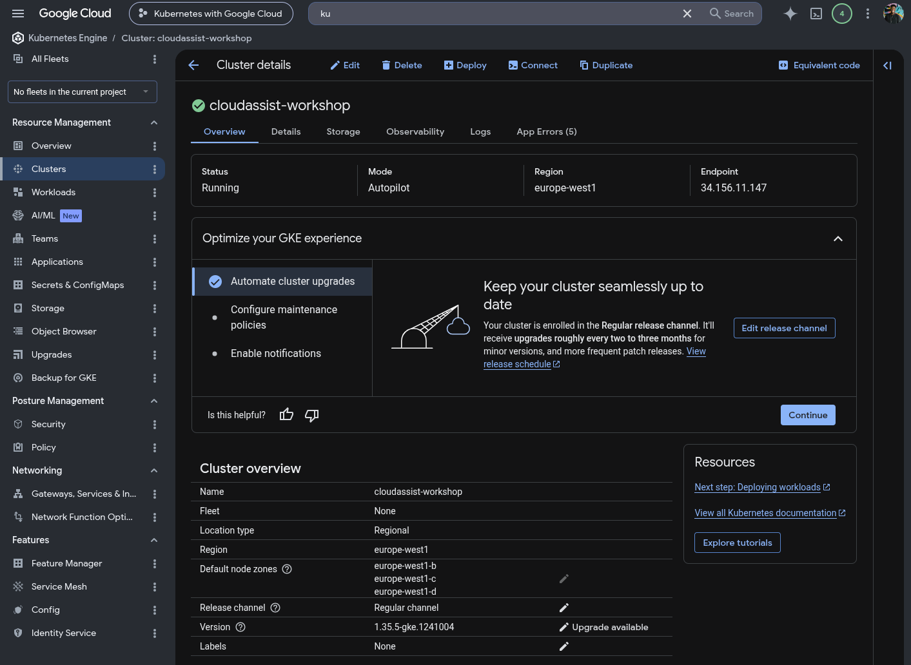
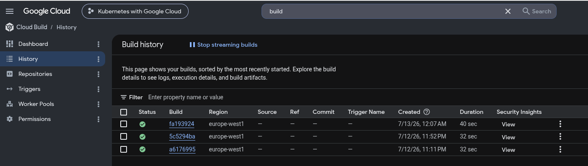
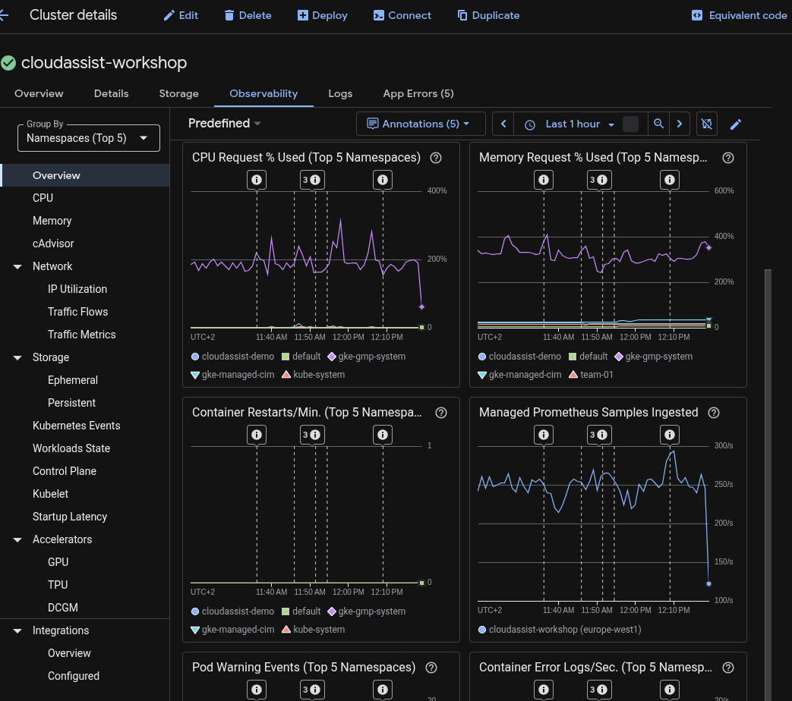
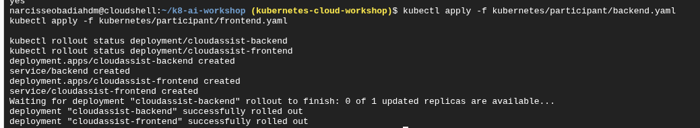
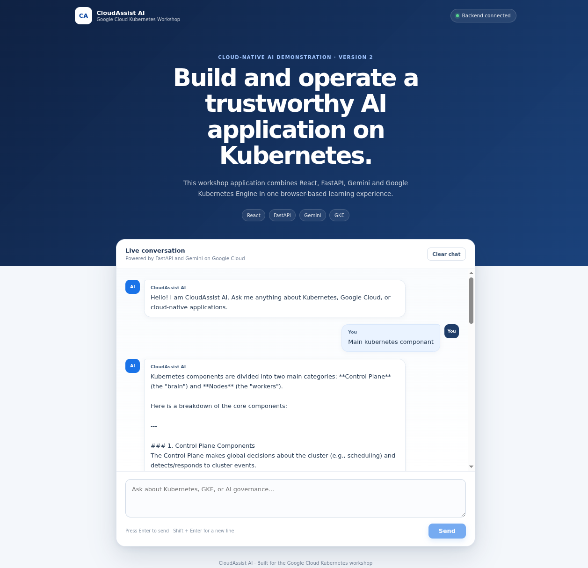
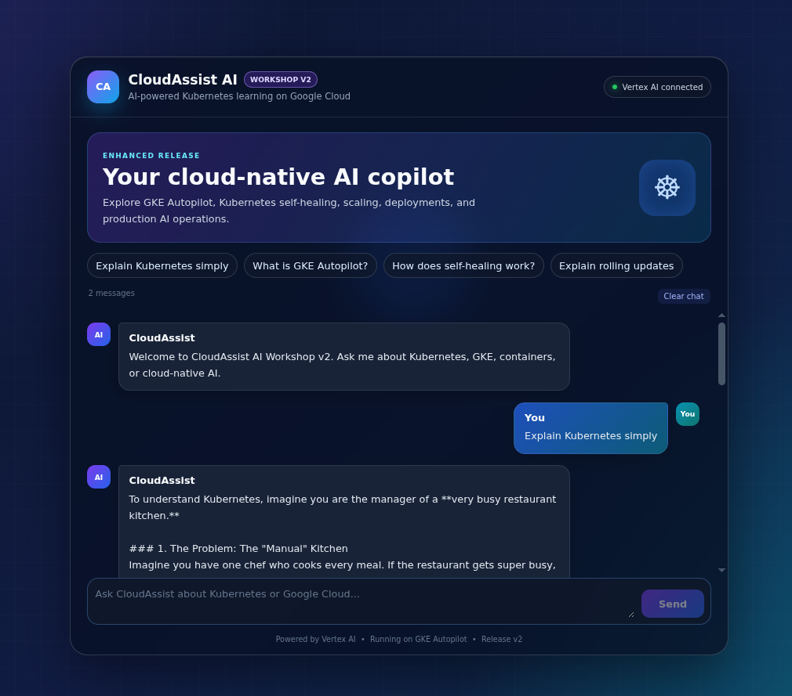

# CloudAssist AI Workshop Platform


**CloudAssist AI** is a production-inspired, full-stack generative AI application and Kubernetes workshop platform built on Google Cloud.

I designed the platform to teach approximately **35 participants** how to deploy, operate, troubleshoot, update, and secure an AI application on Google Kubernetes Engine.

The project demonstrates platform engineering, cloud-native application delivery, Kubernetes operations, identity and access management, automation, observability, and technical enablement.

## Documentation

| Resource | Purpose |
|---|---|
| [Participant Guide](docs/PARTICIPANT_GUIDE.md) | Complete hands-on workshop |
| [Platform Architecture](docs/architecture.md) | Application, infrastructure, identity, and namespace design |
| [Implementation Guide](docs/implementation-guide.md) | End-to-end platform build and deployment |
| [Operations](docs/operations.md) | Recovery, troubleshooting, rollout, rollback, and cleanup |
| [Security and Access](docs/security-and-access.md) | IAM, RBAC, Workload Identity, isolation, and security boundaries |

Facilitator-only procedures and participant information are maintained outside this public repository.

---

## Why I Built It

The project solves two related challenges:

1. Build and deploy a working generative AI application on Kubernetes.
2. Provide a secure, repeatable, and cost-conscious environment where multiple participant teams can operate the application independently.

The platform uses one shared regional GKE Autopilot cluster with a dedicated namespace for each team. Participants receive enough access to deploy and operate their workloads without receiving project-owner or cluster-administrator permissions.

## Architecture

### Application flow

```text
Participant browser
  ↓
React + Nginx frontend
  ↓
FastAPI backend
  ↓
Google Gen AI SDK
  ↓
Vertex AI
  ↓
Gemini
```

### Delivery flow

```text
GitHub
  ↓
Google Cloud Build
  ↓
Artifact Registry
  ↓
GKE Autopilot
```

### Google Cloud environment

| Component | Value |
|---|---|
| Project | `kubernetes-cloud-workshop` |
| Region | `europe-west1` |
| GKE cluster | `cloudassist-workshop` |
| Cluster mode | Autopilot |
| Artifact Registry repository | `cloudassist` |

Container releases:

```text
backend:workshop-v1
frontend:workshop-v1
frontend:workshop-v2
```

For the full design, see the [Platform Architecture](docs/architecture.md).

---

## Platform in Action

### GKE Autopilot



The application runs on a regional GKE Autopilot cluster. Autopilot manages the underlying compute infrastructure while the workshop focuses on workload configuration, identity, access control, reliability, and participant experience.

### Cloud Build



Google Cloud Build produces the backend image and the two versioned frontend releases. The resulting images are stored in Artifact Registry and deployed to GKE.

### Observability



GKE workloads are observable through Cloud Logging and Cloud Monitoring. The platform supports troubleshooting through workload health, resource usage, Pod status, container logs, and Kubernetes events.

---

## Application Components

### Frontend

The frontend uses React, TypeScript, Vite, and Nginx.

Nginx serves the compiled application and proxies `/api/` requests to the internal backend Kubernetes Service.

Two releases support the deployment exercise:

```text
workshop-v1 — original interface
workshop-v2 — redesigned interface
```

Initial deployment:

```bash
kubectl apply -f kubernetes/participant/backend.yaml
kubectl apply -f kubernetes/participant/frontend.yaml

kubectl rollout status deployment/cloudassist-backend
kubectl rollout status deployment/cloudassist-frontend
```



#### Frontend version 1



#### Frontend version 2



### Backend

The backend uses Python, FastAPI, Uvicorn, and the Google Gen AI SDK.

It receives prompts from the frontend, sends them to Gemini through Vertex AI, and returns the generated response.

The backend does not store Gemini API keys or downloadable service-account key files.

---

## Multi-Team Kubernetes Design

The workshop uses one shared cluster with a separate namespace for every team:

```text
team-01
team-02
team-03
...
team-XX
```

Each namespace contains:

- a `ResourceQuota`;
- a `LimitRange`;
- a Kubernetes ServiceAccount;
- a namespace RoleBinding;
- frontend and backend Deployments;
- internal ClusterIP Services.

The participant manifests are namespace-neutral, so every team uses the same deployment files after selecting its assigned namespace.

This provides a simple internal platform **golden path**: participants can deploy through a standardized workflow without designing the underlying identity, networking, quotas, or registry configuration themselves.

## Automated Team Provisioning

Participant environments are created from a CSV file using the workshop administration scripts.

```text
teams_lead.csv
  ↓
provision-teams.py
  ↓
Namespace
  + ResourceQuota
  + LimitRange
  + Kubernetes ServiceAccount
  + RoleBinding
  + Vertex AI IAM permission
```

Access is validated with:

```bash
python3 workshop-admin/verify-teams.py teams_lead.csv
```

Expected authorization model:

```text
Assigned namespace: allowed
Delete Pods in assigned namespace: allowed
Another team namespace: denied
Create namespaces: denied
```

The real participant CSV contains personal information and is excluded from the public repository.

---

## Identity, Access, and Cost Controls

Every team namespace contains a Kubernetes ServiceAccount named:

```text
cloudassist-backend
```

The backend authenticates through Workload Identity Federation for GKE:

```text
Backend Pod
  ↓
Kubernetes ServiceAccount
  ↓
Workload Identity Federation
  ↓
Google Cloud IAM
  ↓
roles/aiplatform.user
  ↓
Vertex AI
```

This avoids API keys in source code, service-account JSON files in images, and long-lived Google Cloud credentials in Kubernetes.

Participants can deploy and operate workloads only inside their assigned namespace. They cannot create namespaces, modify Kubernetes RBAC, administer the cluster, manage project IAM or billing, or create public LoadBalancer and NodePort Services.

ResourceQuotas and LimitRanges control CPU, memory, Pod counts, Service counts, and other namespace resources.

Participant Services use `ClusterIP`, and participants access the application through Cloud Shell:

```bash
kubectl port-forward service/cloudassist-frontend 8080:8080
```

This avoids creating a separate public load balancer for every team.

---

## Workshop Experience

Each participant completes the full workflow:

```text
Authenticate
  ↓
Connect to GKE
  ↓
Select team namespace
  ↓
Deploy backend and frontend v1
  ↓
Inspect workloads, logs, and events
  ↓
Open the application
  ↓
Delete a Pod and observe self-healing
  ↓
Roll out frontend v2
  ↓
Roll back to v1
  ↓
Clean the application resources
```

After one member finishes, the application resources are removed while the namespace, RBAC, quota, LimitRange, and ServiceAccount remain available. The next member then reproduces the complete exercise.

The core Kubernetes operations include:

```bash
# Self-healing
kubectl delete pod -l app=cloudassist-backend

# Rolling update
kubectl set image deployment/cloudassist-frontend \
  frontend=europe-west1-docker.pkg.dev/kubernetes-cloud-workshop/cloudassist/frontend:workshop-v2

# Rollback
kubectl rollout undo deployment/cloudassist-frontend

# Troubleshooting
kubectl logs deployment/cloudassist-backend --tail=100
kubectl get events --sort-by='.lastTimestamp'
```

---

## Run Locally

Clone the repository:

```bash
git clone https://github.com/NarcisseObadiah/k8s-ai-workshop.git
cd k8s-ai-workshop
```

Start the frontend and backend:

```bash
docker compose up --build
```

Open:

```text
Frontend: http://localhost:8081
Backend:  http://localhost:8080
```

Stop the application:

```bash
docker compose down
```

For the complete cloud deployment process, see the [Implementation Guide](docs/implementation-guide.md).

---

## Technology Stack

| Area | Technologies |
|---|---|
| Frontend | React, TypeScript, Vite, Nginx |
| Backend | Python, FastAPI, Uvicorn |
| Generative AI | Google Gen AI SDK, Vertex AI, Gemini |
| Containers | Docker, Docker Compose |
| Build and registry | Google Cloud Build, Artifact Registry |
| Kubernetes | GKE Autopilot, Deployments, Services, HPA |
| Identity | Google Cloud IAM, Workload Identity Federation |
| Authorization | Kubernetes RBAC, namespace RoleBindings |
| Governance | ResourceQuota, LimitRange |
| Observability | Cloud Logging, Cloud Monitoring, Kubernetes events |
| Automation | Python and shell scripts |

## Repository Structure

```text
.
├── backend/
├── frontend/
├── kubernetes/
│   ├── facilitator-funded/
│   └── participant/
├── workshop-admin/
│   ├── participant-clusterrole.yaml
│   ├── provision-teams.py
│   ├── reset-team.sh
│   └── verify-teams.py
├── docs/
│   ├── PARTICIPANT_GUIDE.md
│   ├── architecture.md
│   ├── implementation-guide.md
│   ├── operations.md
│   ├── security-and-access.md
│   └── images/
├── compose.yaml
└── README.md
```

---

## Engineering Scope

CloudAssist AI demonstrates production-oriented engineering practices:

- containerized application delivery;
- versioned releases;
- keyless cloud authentication;
- least-privilege authorization;
- namespace-scoped environments;
- resource governance;
- automated provisioning;
- workload health checks;
- centralized logging and monitoring;
- self-healing;
- rolling updates and rollback;
- operational recovery.

It is intentionally described as **production-inspired**, not fully production-grade.

A customer-facing production version would additionally require application authentication, HTTPS, NetworkPolicies, automated CI/CD promotion, vulnerability and secret scanning, image signing, rate limiting, prompt-safety controls, formal SLOs, load testing, and disaster-recovery procedures.

## Project Outcome

The platform was designed not only to run an AI application, but to provide a secure and repeatable environment in which approximately 35 participants could learn how modern cloud-native systems are delivered and operated.


