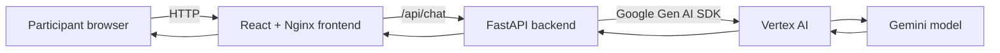
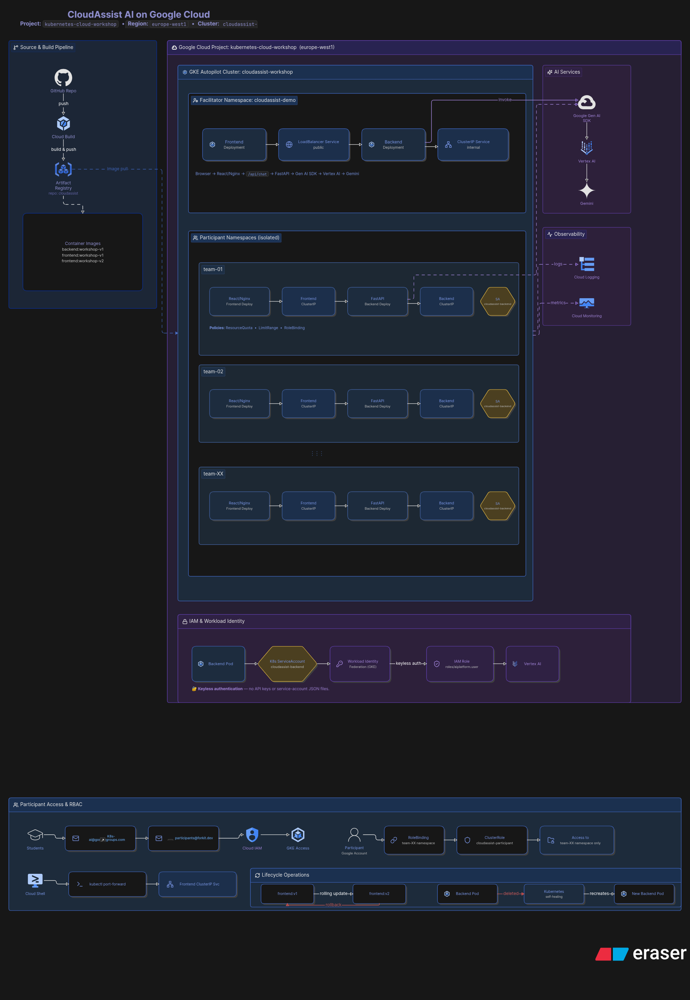
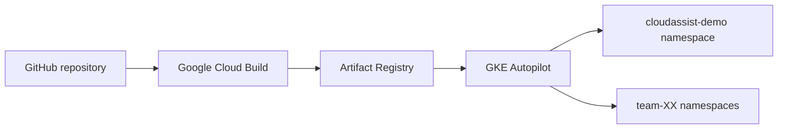
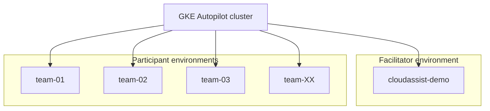
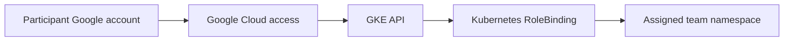
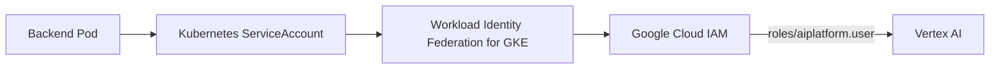

# CloudAssist AI Architecture

This document explains the technical architecture and platform-engineering decisions behind CloudAssist AI.

CloudAssist AI is a production-inspired educational platform built to teach approximately 35 participants how to deploy and operate a full-stack generative AI application on Kubernetes.

> This repository demonstrates production engineering patterns, but it is not presented as a fully hardened production service.

## System Context

The platform combines:

- a React and TypeScript web interface;
- Nginx for static content and API proxying;
- a Python FastAPI backend;
- the Google Gen AI SDK;
- Gemini through Vertex AI;
- container images stored in Artifact Registry;
- workloads running on GKE Autopilot;
- Workload Identity Federation for keyless Google Cloud access;
- namespace-scoped participant access through Kubernetes RBAC.




ARCHITECTURE: 




## Delivery Architecture

Source code is maintained in GitHub. Cloud Build builds the Docker images and publishes them to Artifact Registry. GKE pulls those versioned images into Kubernetes Deployments.



Current environment:

| Component | Value |
|---|---|
| Google Cloud project | `kubernetes-cloud-workshop` |
| Region | `europe-west1` |
| GKE cluster | `cloudassist-workshop` |
| Artifact Registry repository | `cloudassist` |
| Backend image | `backend:workshop-v1` |
| Frontend images | `frontend:workshop-v1`, `frontend:workshop-v2` |


Artifact Registry:

docs/images/artifact-registry-images.png

Frontend tags:

docs/images/artifact-frontends-tags.png


## Application Architecture

### Frontend

The frontend is built with React, TypeScript, and Vite. Its production image uses Nginx to:

1. serve the compiled frontend assets;
2. listen on container port `8080`;
3. proxy `/api/` requests to the Kubernetes Service named `backend`.

The frontend and backend therefore communicate through Kubernetes service discovery rather than a fixed backend IP address.

### Backend

The backend is a FastAPI application served by Uvicorn. It receives the user prompt, calls Gemini through Vertex AI, and returns the model response to the frontend.

Runtime configuration is supplied with environment variables:

```text
GOOGLE_CLOUD_PROJECT=kubernetes-cloud-workshop
GOOGLE_CLOUD_LOCATION=global
GEMINI_MODEL=gemini-3.1-flash-lite
```

The backend Deployment uses readiness and liveness probes and declares CPU and memory requests and limits.

### Kubernetes Services

Participant workloads use internal `ClusterIP` Services:

```text
cloudassist-frontend:8080
backend:8080
```

Participants access the application with `kubectl port-forward`, avoiding a separate public load balancer for every team.

The facilitator demonstration uses a `LoadBalancer` Service in the `cloudassist-demo` namespace.

## Multi-Team Platform Model

The workshop uses one shared GKE Autopilot cluster and one namespace per team.



Each team namespace contains:

- a `ResourceQuota`;
- a `LimitRange`;
- a Kubernetes ServiceAccount named `cloudassist-backend`;
- a namespace RoleBinding;
- frontend and backend Deployments;
- internal Services;
- optional HorizontalPodAutoscaler resources.

The participant manifests do not specify a namespace. The same manifests can therefore be applied to any assigned team namespace.


## Identity and Access Flow

Human access and workload access are separate.

### Human access

A participant authenticates to Google Cloud with their Google account, connects to the GKE cluster, and receives permissions inside only the assigned namespace through a RoleBinding.



### Workload access

The backend does not require a downloaded service-account key or Gemini API key.



Each namespace-specific Kubernetes ServiceAccount is represented by an IAM principal and receives only the Vertex AI user role required by the application.


## Resource and Cost Controls

The provisioning automation applies a quota to every team namespace. The current quota prevents participants from creating public `LoadBalancer` or `NodePort` Services and limits compute and Kubernetes object consumption.

| Resource | Limit |
|---|---:|
| CPU requests | `2` |
| Memory requests | `4Gi` |
| CPU limits | `4` |
| Memory limits | `8Gi` |
| Pods | `10` |
| Services | `5` |
| Deployments | `5` |
| HorizontalPodAutoscalers | `2` |
| LoadBalancer Services | `0` |
| NodePort Services | `0` |

A `LimitRange` supplies default requests of `100m` CPU and `128Mi` memory, and default limits of `500m` CPU and `1Gi` memory.

## Reliability Demonstrations

The workshop intentionally exposes participants to:

- readiness and liveness probes;
- Deployment-managed Pod self-healing;
- rolling image updates;
- rollout status;
- rollback to the previous ReplicaSet;
- logs and events;
- controlled cleanup and exercise reproduction.

## Key Design Decisions

### One shared cluster

A single cluster reduces workshop cost and setup time compared with one cluster per participant.

### One namespace per team

Namespaces provide a practical administrative boundary for RBAC, quotas, naming, and cleanup.

### Namespace-neutral manifests

A reusable manifest set provides a simple platform golden path and reduces participant error.

### ClusterIP plus port-forward

This avoids creating many external load balancers while still giving every team access to its own application.

### Direct Workload Identity principals

Each backend workload receives keyless, namespace-specific access to Vertex AI.

### Versioned frontend images

`workshop-v1` and `workshop-v2` provide a visible rolling-update and rollback exercise.

## Known Boundaries

Namespace separation and RBAC are appropriate for this controlled workshop, but they are not equivalent to hard multi-tenant isolation.

The current platform does not yet include:

- application-level authentication;
- Kubernetes NetworkPolicies between team namespaces;
- HTTPS and a managed domain for participant workloads;
- policy-as-code enforcement;
- signed image verification;
- automated environment promotion;
- formal SLOs, alerting, or disaster recovery.

These are documented as future production-hardening opportunities rather than hidden limitations.

## Related Documentation

- [Participant Guide](PARTICIPANT_GUIDE.md)
- [Implementation Guide](implementation-guide.md)
- [Operations Guide](operations-and-security.md)
