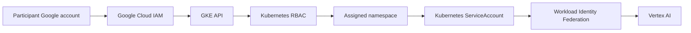

# CloudAssist AI Security and Access Model

This document explains the identity, authorization, isolation, and data-handling controls used by the CloudAssist AI workshop platform.

## Security Goals

The platform is designed to:

- avoid distributing project-owner or cluster-administrator permissions;
- restrict each participant lead to an assigned namespace;
- prevent participants from creating public Kubernetes Services;
- avoid downloadable service-account keys and embedded Gemini API keys;
- limit workload access to the Vertex AI permission required by the backend;
- cap resource consumption per team;
- keep participant personal information out of the public repository.

## Trust Boundaries

The platform has four main trust boundaries:

1. **Public repository** — source code, reusable manifests, example data, and public documentation.
2. **Google Cloud IAM** — project and Google Cloud API access.
3. **Kubernetes RBAC** — cluster and namespace operations.
4. **Workload identity** — backend access to Vertex AI.



## Human Identity

Participants authenticate with their own Google accounts.

Project-level access allows them to discover and connect to GKE. Kubernetes permissions are granted separately through namespace RoleBindings.

This separation prevents project access from automatically becoming unrestricted Kubernetes access.

## Kubernetes Authorization

The shared ClusterRole `cloudassist-participant` defines the operations required by the exercise.

It permits participants to:

- inspect Pods, events, ServiceAccounts, Deployments, ReplicaSets, Services, ConfigMaps, and HPAs;
- read Pod logs;
- create and update Deployments;
- create internal Services;
- delete Pods for the self-healing exercise;
- use port-forwarding;
- scale Deployments;
- perform rolling updates and rollbacks.

A namespace RoleBinding attaches the role to the assigned participant lead.

Participants are not granted permission to:

- create namespaces;
- manage nodes;
- modify Kubernetes RBAC;
- read or modify Secrets through the workshop role;
- administer another team namespace;
- modify project IAM or billing.

## Namespace Isolation

Every team receives a namespace such as:

```text
team-01
team-02
team-03
```

Namespaces provide boundaries for:

- resource names;
- RBAC;
- quotas;
- default limits;
- ownership;
- cleanup.

### Important limitation

Namespaces and RBAC provide administrative isolation, not complete hostile multi-tenancy.

The current repository does not define NetworkPolicies. Namespace separation should therefore not be described as network-level isolation. The design is appropriate for a supervised workshop with known participants.

## Keyless Workload Authentication

The backend Pod uses the Kubernetes ServiceAccount:

```text
cloudassist-backend
```

The ServiceAccount is represented as a Workload Identity Federation principal:

```text
principal://iam.googleapis.com/projects/PROJECT_NUMBER/locations/global/workloadIdentityPools/PROJECT_ID.svc.id.goog/subject/ns/NAMESPACE/sa/cloudassist-backend
```

The principal receives:

```text
roles/aiplatform.user
```

The application does not require:

- a Gemini API key in source code;
- a service-account JSON key in the image;
- a Kubernetes Secret containing a long-lived Google Cloud credential.

<!-- Save the identity diagram as:
docs/images/architecture/workload-identity-flow.png
-->

## Resource Controls

Every team namespace receives a `ResourceQuota` and `LimitRange`.

The quota controls:

- requested and limited CPU;
- requested and limited memory;
- Pod count;
- Service count;
- ConfigMap count;
- Deployment count;
- HorizontalPodAutoscaler count;
- public Service types.

The values below prevent participant namespaces from creating external Services:

```text
services.loadbalancers: 0
services.nodeports: 0
```

The `LimitRange` supplies default requests and limits when they are omitted.

## Network Exposure

### Participant workloads

Participant Services use `ClusterIP` and are not directly exposed to the public internet.

Participants access their frontend with:

```bash
kubectl port-forward   service/cloudassist-frontend   8080:8080
```

### Facilitator demonstration

The facilitator frontend uses a public `LoadBalancer` Service.

The application does not currently include user authentication, so this endpoint should be treated as a temporary workshop endpoint rather than a permanent production service.

## Repository Data Protection

The public repository may contain:

- source code;
- Dockerfiles;
- Kubernetes manifests;
- example CSV files;
- public participant instructions;
- architecture and implementation documentation.

It must not contain:

- the real `teams_lead.csv`;
- participant email addresses;
- passwords or access tokens;
- service-account JSON keys;
- private facilitator procedures;
- billing screenshots;
- unredacted IAM screenshots.

Before pushing:

```bash
git status
git diff --cached

git grep -nE   'BEGIN PRIVATE KEY|private_key|client_secret|access_token'
```

Review screenshots manually for personal information and credentials.

## Access Validation

Test the participant identity explicitly:

```bash
kubectl auth can-i create deployments   --namespace=team-01   --as=participant@example.com

kubectl auth can-i delete pods   --namespace=team-01   --as=participant@example.com

kubectl auth can-i create deployments   --namespace=team-02   --as=participant@example.com

kubectl auth can-i create namespaces   --as=participant@example.com
```

Expected:

```text
yes
yes
no
no
```

Run the automated validation:

```bash
python3 workshop-admin/verify-teams.py teams_lead.csv
```

## Security Assumptions

The workshop assumes:

- participants are known and supervised;
- teams cooperate rather than intentionally attack other workloads;
- the workshop is time-limited;
- participant Services remain internal;
- the facilitator retains recovery access;
- prompts do not contain confidential or regulated information.

## Known Security Gaps

The following controls would be needed before calling the platform production-grade:

- application authentication and authorization;
- HTTPS with managed certificates;
- NetworkPolicies or stronger tenant isolation;
- separate development, staging, and production projects;
- policy-as-code for workload admission;
- vulnerability gates and signed-image verification;
- dependency and secret scanning in CI;
- rate limiting and abuse protection;
- prompt-safety controls;
- audit-log review and retention policies;
- data-classification and prompt-retention rules;
- formal incident response;
- SLOs, alerts, backups, and recovery testing.

## Production Hardening Roadmap

1. Add automated tests, dependency scanning, and container scanning.
2. Separate development and production environments.
3. Add HTTPS, application identity, and rate limiting.
4. Add NetworkPolicies and admission policies.
5. Sign images and enforce provenance.
6. Add structured logging, dashboards, alerts, and SLOs.
7. Conduct load, failure, and security testing.
8. Document data handling and incident response.

## Related Documentation

- [Architecture](architecture.md)
- [Implementation Guide](implementation-guide.md)
- [Operations Guide](operations.md)
- [Security and access Guide](security-and-access.md)
- [Participant Guide](PARTICIPANT_GUIDE.md)